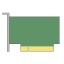
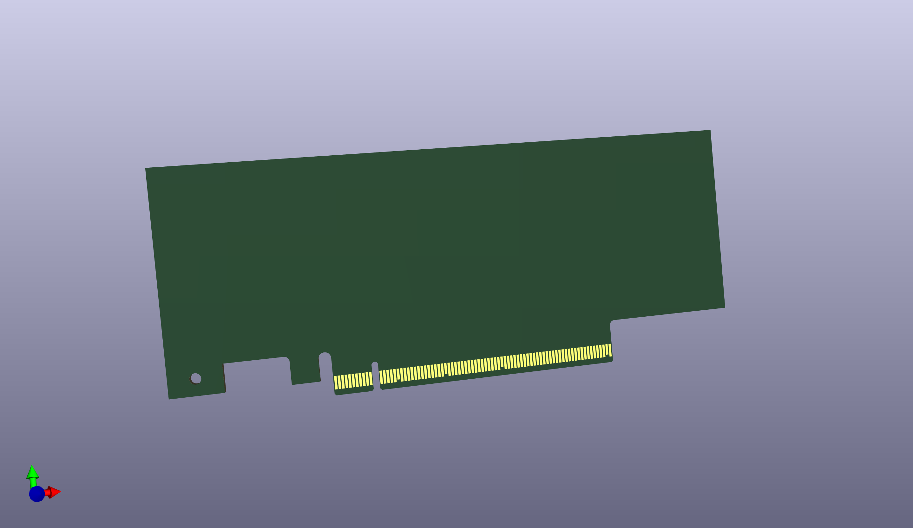

# PCIe templates

Here are my KiCad templates for PCI Express add-in cards.
They are standard sizes based on "PCI EXPRESS CARD ELECTROMECHANICAL SPECIFICATION, REV. 2.0" document

In order to use those templates you will need my [symbol](https://github.com/dbozec/my-kicad-symbols/blob/master/Connector_PCIe.kicad_sym) and [footprint](https://github.com/dbozec/my-kicad-footprints/tree/master/Connector_PCIe.pretty) libraries for PCIe

These templates are distributed in the hope that they will be useful, but **WITHOUT ANY WARRANTY**

DXF files available for you to create your own board shapes.

All files availaible under Creative Commons attribution. cc-by [dbozec](https://github.com/dbozec)
